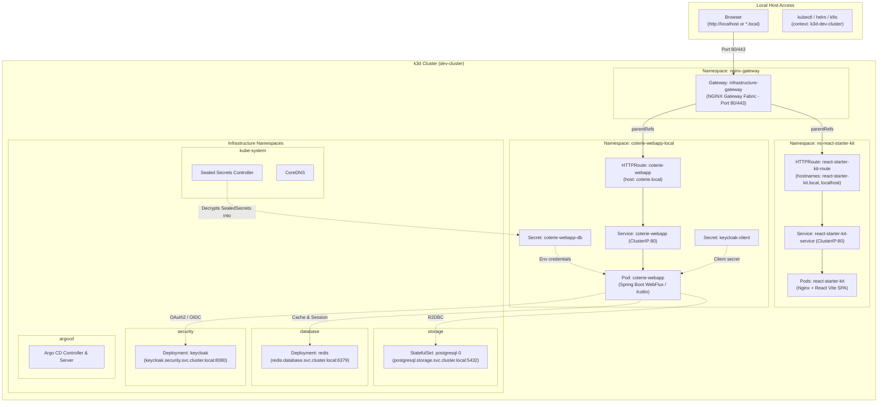

# Local Kubernetes Stack (VPS Mirror on K3d)

A production-parity Kubernetes environment using [k3d](https://k3d.io/) + [K3s](https://k3s.io/) mirroring the VPS architecture.

**Identical routing (Gateway API), GitOps (Argo CD), storage, and secret controllers. What works locally works on the VPS.**

---

## Cluster Component Architecture



---

## Application Request & Data Flow (Spring WebFlux / Coterie)

```mermaid
sequenceDiagram
    autonumber
    actor User as User Browser
    participant GW as NGINX Gateway Fabric (Port 80)
    participant Spring as Coterie WebApp (Spring WebFlux)
    participant KC as Keycloak (OAuth2 / OIDC)
    participant DB as PostgreSQL (storage)
    participant Redis as Redis (database)

    User->>GW: GET http://coterie.local/ (Session Cookie / Auth Header)
    GW->>Spring: HTTPRoute reverse-proxy to Service:8080
    alt Unauthenticated Request
        Spring-->>User: Redirect to /login or Keycloak Auth Code
    else Authenticated Request (JWT / Session)
        Spring->>KC: Validate Token / Introspection (internal keycloak.security:8080)
        KC-->>Spring: Valid Token + Claims (roles, org_id)
        Spring->>Redis: Rate limiting & session check
        Redis-->>Spring: OK
        Spring->>DB: Execute Reactive Use Case (R2DBC non-blocking)
        DB-->>Spring: Domain Entities
        Spring-->>GW: HTML Server-Side Rendered (Kotlinx.html + HTMX)
        GW-->>User: HTTP 200 OK
    end
```



---

## Architecture Parity Matrix

| Component | Local (k3d) | VPS (k3s) | Notes |
|-----------|-------------|-----------|-------|
| **K3s Version** | `v1.29.0+k3s1` | `v1.29.0+k3s1` | Pinned exact match |
| **Traffic Ingress** | Gateway API v1.2.0 + NGINX Gateway Fabric 2.4.1 | Gateway API v1.2.0 + NGINX Gateway Fabric 2.4.1 | `infrastructure-gateway` in `nginx-gateway` namespace |
| **GitOps** | Argo CD v2.14+ in `argocd` | Argo CD in `argocd` | Dynamic App deployment & sync |
| **Database** | PostgreSQL in `storage` | PostgreSQL in `storage` | Service: `postgresql.storage.svc.cluster.local:5432` |
| **Cache/Sessions**| Redis in `database` | Redis in `database` | Service: `redis.database.svc.cluster.local:6379` |
| **Secrets Engine** | Sealed Secrets in `kube-system` | Sealed Secrets in `kube-system` | Public key exported to `local/secrets/` |
| **IAM** (Optional) | Keycloak in `security` | Keycloak in `security` | Service: `keycloak.security.svc.cluster.local:8080` |

---

## Secrets, Passwords & Encryption Explained

In an open-source GitOps stack, secrets are handled in specific ways to avoid leaking credentials:

1. **Sealed Secrets (`sealed-secrets-pub.pem` & `SealedSecret` CRDs)**:
   - GitOps requires committing Kubernetes manifests to Git. Committing plain `Secret` resources would expose plaintext passwords.
   - Sealed Secrets uses **asymmetric encryption**: developers encrypt sensitive data with the cluster's public certificate (`local/secrets/sealed-secrets-pub.pem` or fetched via `kubeseal`).
   - The encrypted `SealedSecret` is safe to commit. Only the in-cluster `sealed-secrets-controller` (in `kube-system`) holds the private key to decrypt it into a live `Secret`.
2. **`ghcr-secret` (`.dockerconfigjson`)**:
   - Container registry token used by kubelet to pull private container images from GitHub Container Registry.
   - Created imperatively per namespace during onboarding to avoid chicken-and-egg dependency locks with Helm PreSync hooks.
3. **Database Credentials (`<app>-db`)**:
   - Managed centrally in PostgreSQL (`storage` namespace). Each application receives its own isolated SQL role and logical database (`<app>-<env>`).
4. **Keycloak Client Secret (`keycloak-client`)**:
   - OAuth2 client credentials used by the backend to introspect user tokens against Keycloak realms.

---

## Database Provisioning & Strategy (Shared vs Per-Namespace)

### The Chosen Pattern: Centralized Instance in `storage` with Logical Isolation
The stack hosts PostgreSQL inside the `storage` namespace (`postgresql.storage.svc.cluster.local:5432`). Each application/environment gets:
- A dedicated SQL user: `CREATE USER "<app-env>" WITH PASSWORD '...';`
- A dedicated logical database: `CREATE DATABASE "<app-env>" OWNER "<app-env>";`
- A Kubernetes `Secret` in the application namespace containing connection properties.

### Why not 1 Database Pod per Namespace?
- **Memory Footprint**: A single PostgreSQL instance uses ~350MB of RAM. Running separate PostgreSQL pods per namespace/branch (e.g., 5 ephemeral branches) would consume ~1.8GB of RAM just for database engines, risking `OOMKilled` on a 4-6GB VPS or developer laptop.
- **Unified Backups**: One automated CronJob in `storage` backs up all databases consistently.
- **Network Isolation**: Inter-namespace access is controlled via `NetworkPolicies` so only authorized application pods can talk to port 5432.

---

## Prerequisites

- **Docker Desktop** (running)
- **k3d** (v5.8+) : `scoop install k3d` or `winget install Rancher.k3d`
- **helm** (v3.14+) : `scoop install helm` or `winget install Helm.Helm`
- **kubectl** : bundled with Docker Desktop or `winget install Kubernetes.kubectl`

---

## Quick Start

### 1. Install / Launch the Mirror Stack
```bash
# Minimal stack (Gateway API, Argo CD, Postgres, Redis, Sealed Secrets) - recommended
./local/install.sh --minimal

# Full stack (including Keycloak and Prometheus/Grafana)
./local/install.sh --all

# Or with Makefile
make local-install
```

### 2. Deploy Reference Applications
```bash
# Deploys:
# - react-starter-kit (Frontend SPA) -> http://localhost/ or http://react-starter-kit.local
# - coterie-webapp (Backend Spring)  -> http://coterie.local
./local/deploy-app.sh --all

# Deploy only frontend SPA:
./local/deploy-app.sh --react-only

# Deploy only backend Spring:
./local/deploy-app.sh --coterie-only
```

### 3. Accessing the Applications in Browser

- **React Starter Kit (SPA)**:
  - Direct access: **http://localhost/** (works immediately without host modifications)
  - Virtual host access: **http://react-starter-kit.local** (requires `/etc/hosts` entry)
- **Coterie WebApp (Backend)**:
  - Add to `C:\Windows\System32\drivers\etc\hosts` (or `/etc/hosts`):
    ```text
    127.0.0.1  coterie.local react-starter-kit.local
    ```
  - Access: **http://coterie.local/**
  - Actuator Health: **http://coterie.local/actuator/health**

---

## Multi-Cluster Context Switching

Your local `~/.kube/config` seamlessly hosts both clusters:
```bash
# Switch to Local k3d cluster
kubectl config use-context k3d-dev-cluster

# Switch back to VPS
kubectl config use-context default
```

---

## Accessing Services & UIs

- **Argo CD UI**:
  ```bash
  kubectl port-forward -n argocd svc/argocd-server 8443:80
  # Open http://localhost:8443
  # Username: admin
  # Password in: local/argocd_password.txt
  ```

- **PostgreSQL CLI**:
  ```bash
  kubectl exec -it -n storage postgresql-0 -- psql -U postgres
  ```

- **Redis CLI**:
  ```bash
  kubectl exec -it -n database deploy/redis -- redis-cli
  ```

---

## Cleanup / Teardown
```bash
./local/uninstall.sh
# or
k3d cluster delete dev-cluster
```
